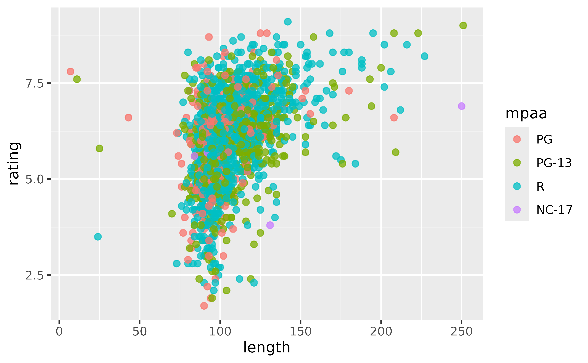

# sap (Shiny App-Packages)

``` r

library(sap)
```

The `sap` package is designed to demonstrate how to build a Shiny
application inside an R package.

## Utility functions

The utility functions in `sap` make it easier to wrangle data, write
tests, render graphs, and display log messages/text logos.

### Tidy `ggplot2movies` data

The `make_tidy_ggp2_movies()` function was written to wrangle the
`ggplot2movies` data into a ‘tidy’ format.

``` r

ggp2mov_url <- "https://raw.githubusercontent.com/hadley/ggplot2movies/refs/heads/master/data-raw/movies.csv"
```

``` r

tidy_movies <- make_tidy_ggp2_movies(movies_data_url = ggp2mov_url)
str(tidy_movies)
#> 'data.frame':    58788 obs. of  10 variables:
#>  $ title      : chr  "$" "$1000 a Touchdown" "$21 a Day Once a Month" "$40,000" ...
#>  $ year       : int  1971 1939 1941 1996 1975 2000 2002 2002 1987 1917 ...
#>  $ length     : int  121 71 7 70 71 91 93 25 97 61 ...
#>  $ budget     : int  NA NA NA NA NA NA NA NA NA NA ...
#>  $ rating     : num  6.4 6 8.2 8.2 3.4 4.3 5.3 6.7 6.6 6 ...
#>  $ votes      : int  348 20 5 6 17 45 200 24 18 51 ...
#>  $ mpaa       : Factor w/ 5 levels "G","PG","PG-13",..: NA NA NA NA NA NA 4 NA NA NA ...
#>  $ genre_count: int  2 1 2 1 0 1 2 2 1 0 ...
#>  $ genres     : chr  "Comedy, Drama" "Comedy" "Animation, Short" "Comedy" ...
#>  $ genre      : Factor w/ 8 levels "Action","Animation",..: 6 3 6 3 NA 5 6 6 5 NA ...
```

This function is not exported from the package, it lives in
`tests/testthat/fixtures/make-tidy_ggp2_movies.R`.

### Test helpers

The `make_var_inputs()` and `make_ggp2_inputs()` functions make it
easier to create test inputs for modules:

``` r

make_var_inputs()
```

    list(y = 'audience_score',
         x = 'imdb_rating',
         z = 'mpaa_rating',
         alpha = 0.5,
         size = 2,
         plot_title = 'Enter plot title'
        )

``` r

make_ggp2_inputs()
```

    list(x = 'rating',
         y = 'length',
         z = 'mpaa',
         alpha = 0.75,
         size = 3,
         plot_title = 'Enter plot title'
         )

These live in `tests/testthat/helper.R` and are not exported from the
package.

### Create scatter plot

The
[`scatter_plot()`](https://mjfrigaard.github.io/sap/reference/scatter_plot.md)
function was written to make it easier to use `ggplot2` functions in the
[`mod_scatter_display_server()`](https://mjfrigaard.github.io/sap/reference/mod_scatter_display_server.md)
function.

Variable inputs are collected from the UI as strings (i.e., `"length"`
and `"rating"`, not `length` and `rating`), which makes it difficult for
standard `ggplot2` calls:

``` r

ggplot2::ggplot(data = na.omit(tidy_movies), 
  mapping = ggplot2::aes(
    x = length,
    y = rating, 
    color = mpaa)) + 
  ggplot2::geom_point(
    alpha = 0.75,
    size = 2)
```


[`scatter_plot()`](https://mjfrigaard.github.io/sap/reference/scatter_plot.md)
allows for strings to be passed to the rendering functions:

``` r

scatter_plot(
  df = na.omit(tidy_movies),
  x_var = "length",
  y_var = "rating",
  col_var = "mpaa",
  alpha_var = 0.75,
  size_var = 2
)
```



### Logs and logos

[`log_message()`](https://mjfrigaard.github.io/sap/reference/log_message.md)
uses base R functions and is simple but effective.

``` r

log_message(
  message = "A log message", 
  save = FALSE)
#> [2026-05-11 18:32:28] A log message
```

[`logr_msg()`](https://mjfrigaard.github.io/sap/reference/logr_msg.md)
is written with the `logger` package and has additional arguments:

``` r

logr_msg(
  message = "A log message", 
  level = "INFO", 
  store_log = FALSE)
#> INFO [2025-03-05 13:57:53] A log message
```

## Applications

### Default (`movies`)

``` default
../inst/www
├── bootstrap.png
└── shiny.png
```

``` r

launch_app()
```

### bslib (`movies`)

``` default
../inst/www
├── bootstrap.png
└── shiny.png
```

``` r

launch_app(app = 'bslib')
```

### ggp2 (tidy `ggplot2movies`)

``` default
../inst/tidy-movies
├── R
│   ├── devServer.R
│   ├── devUI.R
│   ├── dev_mod_scatter.R
│   └── dev_mod_vars.R
├── app.R
├── imdb.png
└── tidy_movies.fst
```

``` r

launch_app(app = 'ggp2')
```

### quarto

``` default
../inst/quarto
├── _quarto.yml
├── index.html
├── index.qmd
└── www
    ├── quarto.png
    └── styles.scss
```

``` r

launch_app(app = 'quarto')
```
