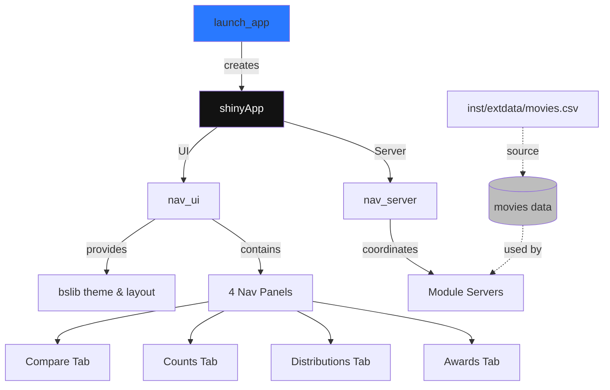
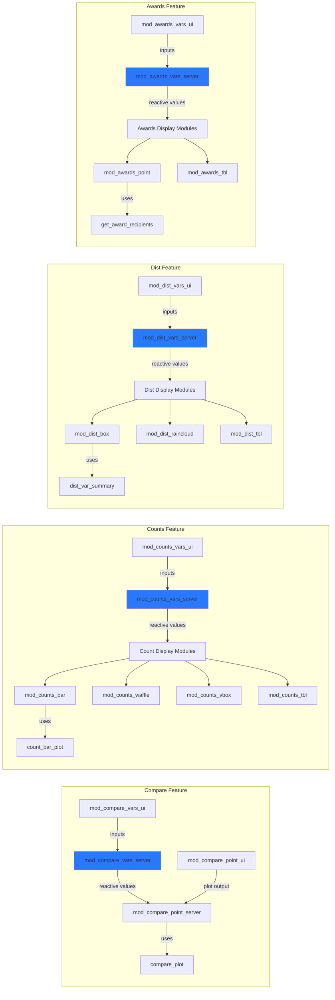
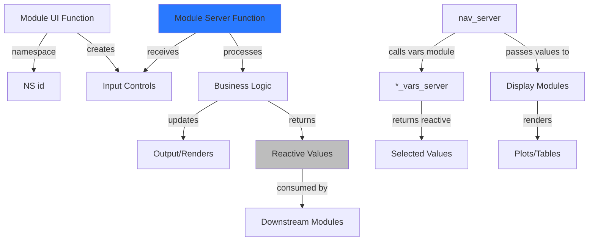
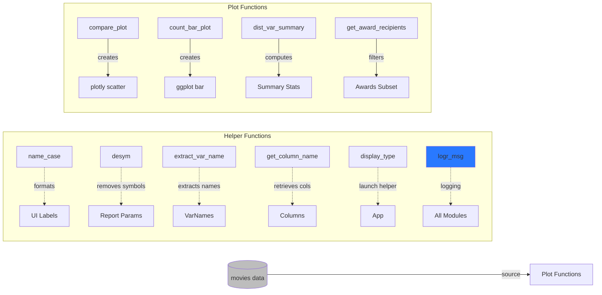
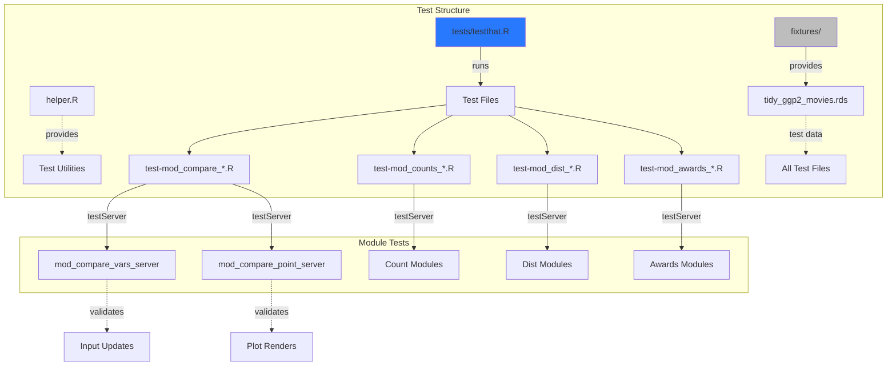
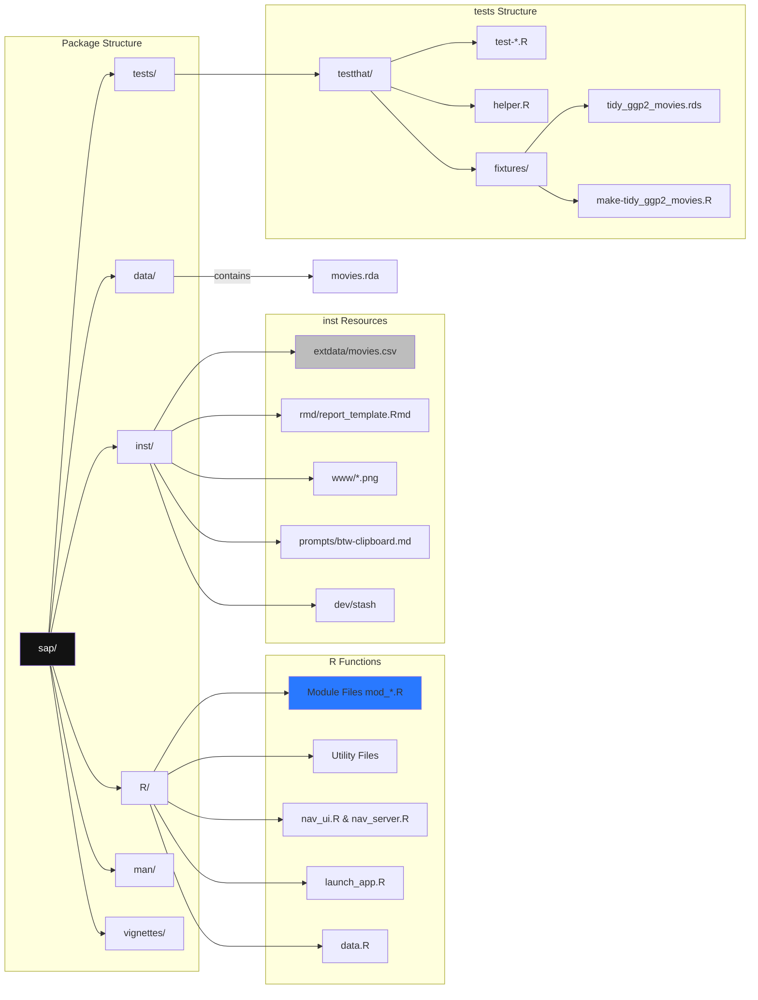
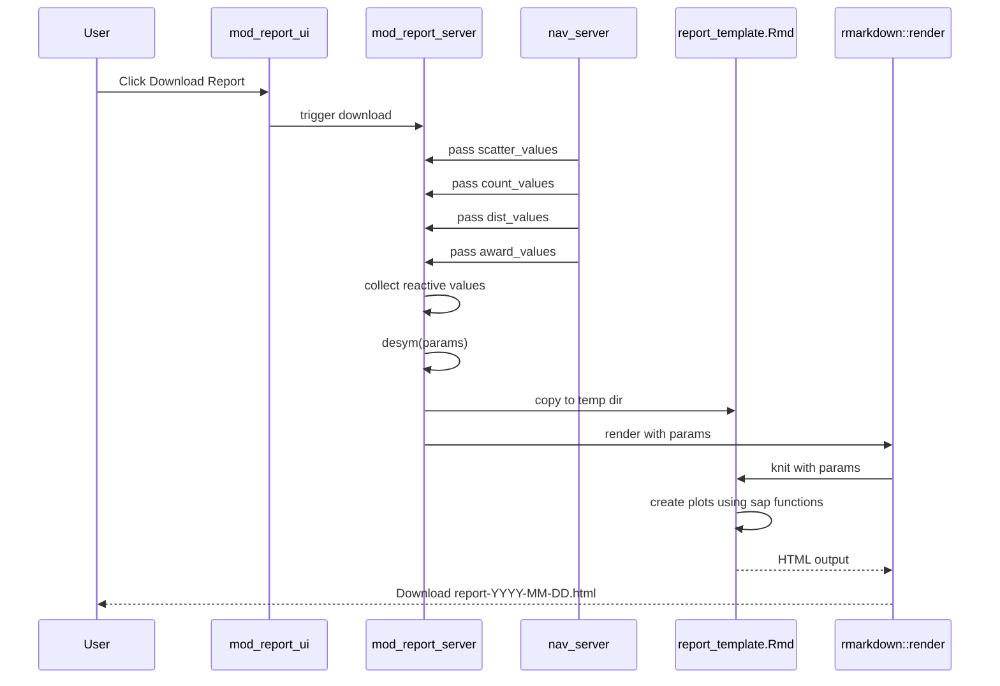

# `btw("@platform_info")`

## Context

```
"@platform_info"
<system_info>
R_VERSION: R version 4.5.1 (2025-06-13)
OS: macOS Sequoia 15.6
SYSTEM: x86_64, darwin20
UI: Positron (a VS Code equivalent)
LANGUAGE: (EN)
LOCALE: en_US.UTF-8
ENCODING: en_US.UTF-8
TIMEZONE: America/Phoenix
DATE: Monday, August 18, 2025 (2025-08-18)
</system_info>
```

# Prompt: `sap` architecture 

> "You are in the root directory of the sap package (sap stands for [S]hiny [A]pp [P]ackage ). Describe the architecture of the package and application, using mermaid diagrams to illustrate connections between the functions (in R/), the files in the inst/ folder, the tests in the tests/ folder."

## Tool calling

I'll explore the structure of the sap package to understand its architecture and create diagrams illustrating the connections.

```bash
◯ [tool call] btw_tool_files_list_files(path = ".", type = "directory", `_intent` = "List all directories in the package root")
● #> | path | type | size | modification_time |
  #> |------|------|------|-------------------|
  #> | R | directory | 1K | 2025-10-22 08:01:23 |
  #> | data | directory | 192 | 2025-10-20 13:35:52 |
  #> | data-raw | directory | 192 | 2025-10-20 13:35:52 |
  #> …
◯ [tool call] btw_tool_files_list_files(path = "R", type = "file", `_intent` = "List R source files")
● #> | path | type | size | modification_time |
  #> |------|------|------|-------------------|
  #> | R/compare_plot.R | file | 2.08K | 2025-10-20 14:04:01 |
  #> | R/count_bar_plot.R | file | 1.46K | 2025-10-20 14:04:01 |
  #> | R/data.R | file | 2.56K | 2025-10-20 13:35:52 |
  #> …
◯ [tool call] btw_tool_files_list_files(path = "inst", type = "any", `_intent` = "List files in inst directory")
● #> | path | type | size | modification_time |
  #> |------|------|------|-------------------|
  #> | inst/dev | directory | 96 | 2025-10-20 14:04:01 |
  #> | inst/dev/stash | file | 8.36K | 2025-10-20 14:04:01 |
  #> | inst/extdata | directory | 128 | 2025-10-20 13:35:52 |
  #> …
◯ [tool call] btw_tool_files_list_files(path = "tests", type = "any", `_intent` = "List test files")
● #> | path | type | size | modification_time |
  #> |------|------|------|-------------------|
  #> | tests/testthat | directory | 608 | 2025-10-20 14:04:01 |
  #> | tests/testthat/fixtures | directory | 128 | 2025-10-20 14:04:01 |
  #> | tests/testthat/fixtures/make-tidy_ggp2_movies.R | file | 1.49K | 2025-10-20 14:04:01 |
  #> …
```

Let me examine some key files to understand the application structure better:

```bash
◯ [tool call] btw_tool_files_read_text_file(path = "R/nav_ui.R", `_intent` = "Read the main UI file")
● #> ```R
  #> #' User Interface for the Shiny Application
  #> #'
  #> #' This function defines the user interface for the Shiny application,
  #> #' integrating Bootstrap and a custom JavaScript file.
  #> …
◯ [tool call] btw_tool_files_read_text_file(path = "R/nav_server.R", `_intent` = "Read the main server file")
● #> ```R
  #> #' Application Navigation Server Logic
  #> #'
  #> #' @param input,output Shiny server input and output objects.
  #> #'
  #> …
◯ [tool call] btw_tool_files_read_text_file(path = "R/launch_app.R", `_intent` = "Read the launch app function")
● #> ```R
  #> #' Launch the Shiny Application
  #> #'
  #> #' This function initializes and launches the Shiny application with specified
  #> #' options and settings.
  #> …
◯ [tool call] btw_tool_files_read_text_file(path = "R/data.R", `_intent` = "Read data documentation")
● #> ```R
  #> #' @title IMDB movies data
  #> #'
  #> #' @description
  #> #' Movie review data. Note: these data come from the [Building Web Applications with shiny
course](https://rstudio-education.github.io/shiny-course/).
  #> …
```

Now let me examine a few module files to understand the module pattern:

```bash
◯ [tool call] btw_tool_files_read_text_file(path = "R/mod_compare_vars.R", ...)
● #> ```R
  #> #' UI for variable comparison module
  #> #'
  #> #' Creates inputs for selecting variables to compare in a scatter plot with
  #> #' customizable appearance options. This function is designed to work together
  #> …
◯ [tool call] btw_tool_files_read_text_file(path = "R/mod_compare_point.R", ...)
● #> ```R
  #> #' UI for comparison point chart module
  #> #'
  #> #' Creates a plotly scatterplot visualization for comparing two variables.
  #> #' This function is designed to work together with [mod_compare_point_server()].
  #> …
◯ [tool call] btw_tool_files_read_text_file(path = "R/mod_report.R", `_intent` = "Read report module")
● #> ```R
  #> #' Report download UI
  #> #'
  #> #' @param id Module ID
  #> #'
  #> …
```

Now let me check some utility functions and test files:

```bash
◯ [tool call] btw_tool_files_read_text_file(path = "R/compare_plot.R", `_intent` = "Read compare_plot utility")
● #> ```R
  #> #' Create an Interactive Scatter Plot for Comparing Variables
  #> #'
  #> #' This function creates an interactive scatter plot using plotly to compare two
  #> #' variables with points colored by a third variable.
  #> …
◯ [tool call] btw_tool_files_read_text_file(path = "tests/testthat/test-mod_compare_vars_server.R", ...)
● #> ```R
  #> # Define a test for the compare_vars module
  #> describe(
  #>  "Feature: Variable Selection Prevention of Duplicate X/Y Variables
  #>  As a user
  #> …
◯ [tool call] btw_tool_files_read_text_file(path = "inst/rmd/report_template.Rmd", ...)
● #> ````Rmd
  #> ---
  #> title: "Movie Analysis Report"
  #> date: "`r format(Sys.time(), '%B %d, %Y')`"
  #> output:
  #> …
```

Perfect! Now I have a comprehensive understanding of the sap package architecture. Let me create detailed mermaid diagrams to illustrate the 
structure.

## SAP Package Architecture Overview

The **sap** (Shiny App Package) is a modular Shiny application for exploring IMDB movie data. It follows best practices for Shiny app development with a clear separation of concerns using Shiny modules.

### 1. High-Level Application Architecture



### 2. Module Architecture by Feature



### 3. Module Communication Pattern



### 4. Utility Functions & Data Flow



### 5. Testing Architecture



### 6. File Organization & Resources



### 7. Report Generation Flow



## Key Architecture Patterns

### **Modular Design**

Each feature (Compare, Counts, Distributions, Awards) follows a consistent pattern:
- **Vars Module**: Handles input controls and returns reactive values
- **Display Modules**: Receive reactive values and render visualizations/tables
- **Utility Functions**: Provide plotting and data manipulation logic

### **Separation of Concerns**

- `nav_ui.R` / `nav_server.R`: Top-level navigation and layout
- `mod_*_vars_*.R`: Input collection modules
- `mod_*_point/bar/box_*.R`: Visualization modules
- `mod_*_tbl_*.R`: Table display modules
- Utility functions in separate files (plotting, formatting, logging)

### **Resource Management**

- **inst/extdata/**: Raw data files
- **inst/rmd/**: R Markdown templates for reports
- **inst/www/**: Static assets (images)
- **data/**: Processed R data objects

### **Testing Strategy**

- One test file per module server function
- `testServer()` for testing module logic
- Fixtures provide consistent test data
- Helper functions in `helper.R` for shared test utilities

### **Logging Integration**

- `logr_msg()` wrapper provides structured logging throughout
- Different log levels (DEBUG, INFO, WARN, ERROR) for tracing execution

This architecture demonstrates best practices for building production-ready Shiny applications as R packages!